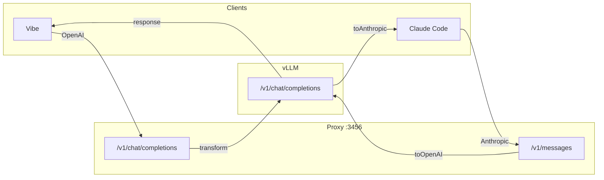

# Token-Gate Proxy

Proxy vLLM avec transformations pipeline pour compatibilité Mistral/vLLM.

## Principes

- **KISS** - Code minimal, pipelines composables
- **Proxy** - Transformation puis forward vers vLLM
- **Composable** - `pipe()` et `when()` pour construire les pipelines

## Flow



## Pipelines

### OpenAI → vLLM

```typescript
const transform = (useVision: boolean) => pipe<OpenAIRequest>(
  when(!useVision, stripOpenAIImages),
  filterEmptyAssistantMessages,
  normalizeOpenAIToolIds,
  sanitizeToolChoice,
);
```

| Transformer | Description |
|-------------|-------------|
| `stripOpenAIImages` | Retire les images si pas de backend vision |
| `filterEmptyAssistantMessages` | Retire messages assistant vides (vLLM rejette) |
| `normalizeOpenAIToolIds` | Retire `index`, sanitize JSON, IDs 9 chars |
| `sanitizeToolChoice` | Retire `tool_choice` si pas de `tools` |

### Anthropic → vLLM → Anthropic

```typescript
const preprocess = pipe<AnthropicRequest>(
  stripAnthropicImages,
  injectWebSearchPrompt,
);
const toOpenAI = (req, useVision) => anthropicToOpenAI(preprocess(req), {...});
const toAnthropic = (res, model) => openAIToAnthropic(res, model);
```

| Transformer | Description |
|-------------|-------------|
| `stripAnthropicImages` | Retire les images si pas de backend vision |
| `injectWebSearchPrompt` | Ajoute instructions web search au system |
| `anthropicToOpenAI` | Convertit format Anthropic → OpenAI |
| `openAIToAnthropic` | Convertit réponse OpenAI → Anthropic |

## Structure

```
src/
├── routes/
│   ├── openai.ts       # transform → vLLM (115 lignes)
│   └── anthropic.ts    # preprocess → toOpenAI → vLLM → toAnthropic (100 lignes)
├── utils/
│   ├── pipeline.ts     # pipe(), when() (10 lignes)
│   ├── convert.ts      # Tous les transformers
│   ├── images.ts       # Gestion images + sanitizeToolChoice
│   └── tokens.ts       # Estimation tokens
└── services/
    └── backend.ts      # Appels HTTP vLLM
```

## Config vLLM

```bash
vllm serve mistralai/Devstral-Small-2-24B-Instruct-2512 \
  --served-model-name devstral-small-2-24b \
  --tool-call-parser mistral \
  --enable-auto-tool-choice
```
