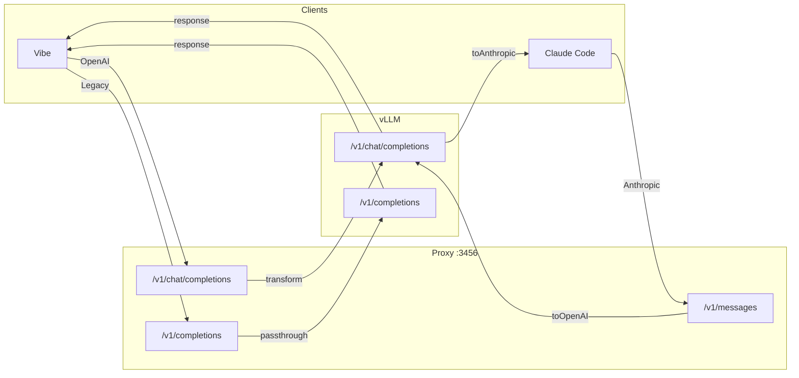

# Token-Gate Proxy

vLLM proxy with pipeline transformations for Mistral/vLLM compatibility.

## Principles

- **KISS** - Minimal code, composable pipelines
- **Proxy** - Transform then forward to vLLM
- **Composable** - `pipe()` and `when()` to build pipelines

## Flow



## Pipelines

### OpenAI → vLLM (117 lines)

```typescript
// Request pipeline - vLLM/Mistral compatibility
const transform = (useVision: boolean) => pipe<OpenAIRequest>(
  when(!useVision, stripOpenAIImages),
  filterEmptyAssistantMessages,
  normalizeOpenAIToolIds,
  sanitizeToolChoice,
);
```

| Transformer | Description |
|-------------|-------------|
| `stripOpenAIImages` | Remove images if no vision backend |
| `filterEmptyAssistantMessages` | Remove empty assistant messages (vLLM rejects) |
| `normalizeOpenAIToolIds` | Strip `index`, sanitize JSON, IDs to 9 chars |
| `sanitizeToolChoice` | Remove `tool_choice` if no `tools` |

**Routes:**
- `POST /v1/chat/completions` - Full pipeline with transformations
- `POST /v1/completions` - Legacy passthrough (no transformation)

### Anthropic → vLLM → Anthropic (101 lines)

```typescript
// Request pipeline: Anthropic → preprocess → OpenAI
const preprocess = pipe<AnthropicRequest>(
  stripAnthropicImages,
  injectWebSearchPrompt,
);
const toOpenAI = (req, useVision) => anthropicToOpenAI(preprocess(req), {...});

// Response pipeline: OpenAI → Anthropic
const toAnthropic = (res, model) => openAIToAnthropic(res, model);
```

| Transformer | Description |
|-------------|-------------|
| `stripAnthropicImages` | Remove images if no vision backend |
| `injectWebSearchPrompt` | Add web search instructions to system |
| `anthropicToOpenAI` | Convert Anthropic → OpenAI format |
| `openAIToAnthropic` | Convert OpenAI → Anthropic response |
| `convertOpenAIStreamToAnthropic` | Convert OpenAI SSE stream → Anthropic |

**Route:**
- `POST /v1/messages` - Bidirectional conversion with streaming

## Pipeline Utils (11 lines)

```typescript
// Compose transformers in sequence
export const pipe = <T>(...fns: Transformer<T>[]): Transformer<T> =>
  (data: T) => fns.reduce((acc, fn) => fn(acc), data);

// Conditional transformer
export const when = <T>(cond: boolean, fn: Transformer<T>): Transformer<T> =>
  cond ? fn : (x) => x;
```

## Structure

```
src/
├── routes/
│   ├── openai.ts       # transform → vLLM (117 lines)
│   ├── anthropic.ts    # preprocess → toOpenAI → vLLM → toAnthropic (101 lines)
│   └── system.ts       # /health, /v1/models
├── utils/
│   ├── pipeline.ts     # pipe(), when() (11 lines)
│   ├── convert.ts      # All transformers (431 lines)
│   ├── images.ts       # Image handling + sanitizeToolChoice (77 lines)
│   ├── tokens.ts       # Token estimation
│   └── auth.ts         # Backend authentication
├── services/
│   └── backend.ts      # vLLM HTTP calls (119 lines)
├── plugins/
│   └── metrics.ts      # Prometheus metrics
└── prompts/
    ├── vision.ts       # Vision system prompt
    └── web-search.ts   # Web search system prompt
```

## vLLM Config

See `docs/vllm/` for detailed configurations:
- `devstral-2-small.md` - Mistral Devstral 24B (2x3090)
- `qwen3-coder.md` - Qwen3 Coder 30B FP8 (2x3090)
